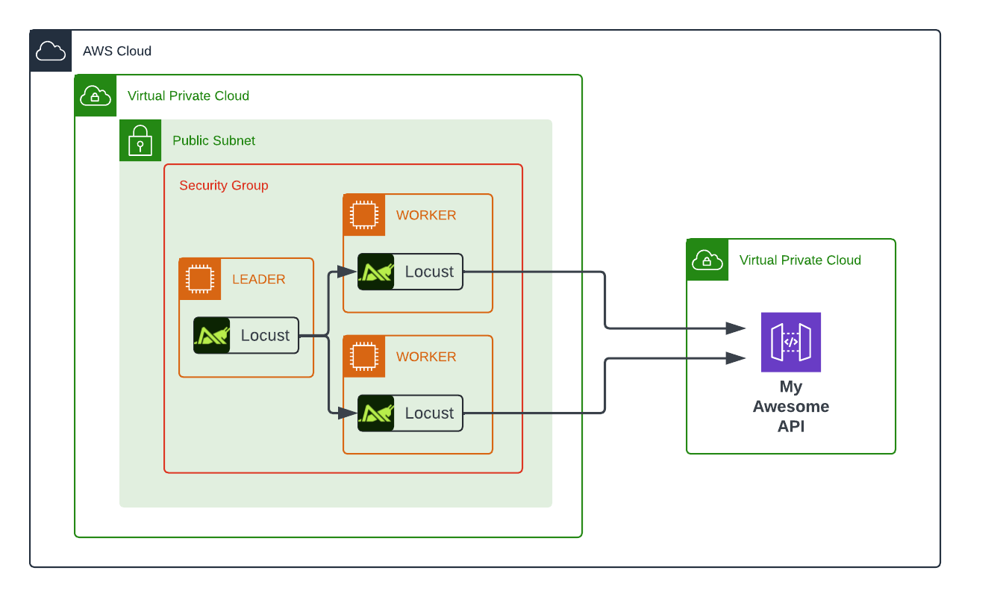

# Testing My Awesome API


## Overview

This project was created as part of a series of articles that explore the practical application of the Python, FastAPI, and SQLAlchemy, highlighting its growing popularity, ease of setup, and performance in real-world scenarios. The goal is to showcase how this modern stack can be leveraged to build efficient, scalable serverless APIs using AWS RDS and Lambda. 

In this part we will be running load tests to the API that we've created


## Prerequisites
- Terraform
- AWS CLI configured


## Running the test with Locust

1. **Change api endpoint in:**

    ```.plan/locustfile.py
    host = "https://<your-api>.execute-api.eu-west-1.amazonaws.com"
    ```

2. **Define the test case run type: simple of full in main.tf**
    ```
    nohup locust \
        -f ${var.locust_plan_filename} \
        --web-port=8080 \
        --tags full_test_case \
        --expect-workers=${var.node_size} \
        --master > locust-leader.out 2>&1 &
    ```

3. **Run Terraform:**
    ```bash
    terraform init
    terraform apply
    ```